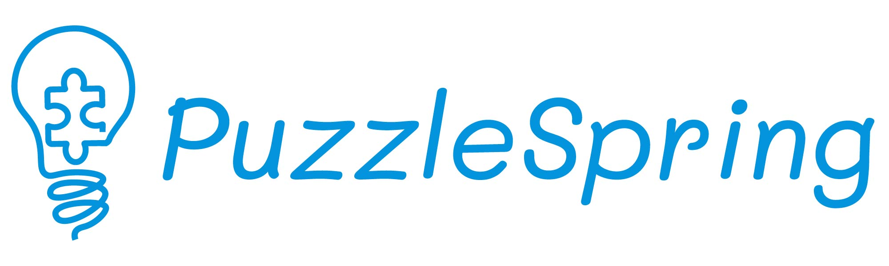

# PuzzleSpring

  

  

    <a href="https://www.puzzlespring.com/docs">Documentation</a> |
    <a href="https://www.puzzlespring.com/docs/getting-started/quickstart.html">Quick Start</a> |
    <a href="https://www.puzzlespring.com/docs/contributing.html">Contributing</a>
  

PuzzleSpring is a Django-based puzzlehunt hosting platform designed to be easy to set up and customize while maintaining powerful features for both hunters and hunt operators. Please see our documentation linked above for how to get started.

## Features

### Platform Features
- **Real-Time Collaboration**: Watch your team's progress in real-time as submissions, hints, and unlocks sync instantly across all team members using server-sent events
- **Simple Deployment**: Get started in minutes with Docker Compose and automatic SSL certificate management through Caddy
- **Flexible Authentication**: Easily add new authentication providers like Google, GitHub, or custom SSO solutions thanks to django-allauth
- **Custom Landing Pages**: Create organization-specific landing pages and information sections without touching code
- **Comprehensive Documentation**: Detailed guides for both basic setup and advanced features

### Hunt Organization
- **Team or Solo Play**: Run competitions for both teams or individual players
- **Permanent Archives**: Every hunt is automatically preserved in a fully playable state
- **Hunt Templates**: Clone, backup, or develop hunts locally thanks to the hunt import/export system
- **Smart Notifications**: Keep users engaged with configurable notifications for submissions, solves, and more via Discord, email, and other platforms

### Puzzle Features
- **Intelligent Answer Checking**: Set up automatic responses for correct and incorrect answers using regex patterns
- **Flexible Puzzle Format**: Support for both HTML and PDF puzzles and solutions
- **Custom Puzzle Pages**: Each puzzle gets its own dedicated page with submission history and hint system

### Hunt Management
- **Advanced Unlocking Logic**: Create complex puzzle progression using any combination of time, points, and solved puzzle conditions
- **Dynamic Leaderboards**: Track competition progress with customizable ranking criteria
- **Pre-Hunt Engagement**: Build excitement with optional "prepuzzle" content before the main event

### Staff Tools
- **Powerful Admin Interface**: Go beyond the standard Django admin with:
  - Visual template editor with live preview
  - Comprehensive puzzle management dashboard
  - Quick and intuitive hint response system
  - Real-time event monitoring via the activity feed
  - Detailed team progress tracking
  - Interactive analytics and charts
  - Quick user/team lookup tools
- **User Preview**: Test the participant experience directly with secure user switching to see how your users will experience the hunt

### Customization & Flexibility
- **Template System**: Fully customize puzzle and hunt pages while maintaining sensible defaults
- **No-Code Configuration**: Configure most features directly through the admin interface
- **Custom Information Pages**: Create FAQs and hunt-specific information pages without development work
- **Extensible Design**: Built to support various puzzle hunt styles and competition formats
