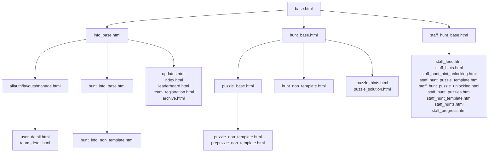
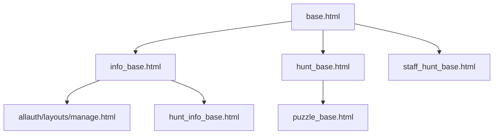

# Puzzlehunt Templates

## Graphs
### Full graph

### Base template graph

## Base templates

There are a number of "base templates" which are not meant to be rendered but just provide a foundation
for other templates to build on.

**base.html**: This template is the base for all other templates. It provides the basic html page
structure, a number of over-writable sections in the \<head\>, the navbar, toast functionality, and a
footer. It provides the following blocks:
- `title`: The contents of the \<title\> tag for the page. Default: ``
- `base_includes`: The earliest place to include things in the head. Default: Empty 
- `bulma_includes`: A block wrapper around the inclusion of our Bulma stylesheet. You can override
this to change or remove the bulma styling from the page. Default: Includes `custom_bulma.css`
- `includes`: A place to include scripts or stylesheets after all the other includes. Default: Empty
- `extra_head`: A final place to insert other content into the \<head\> element. Default: Empty
- `content_wrapper`: A wrapper for the page's main content after the navbar and before the footer.
Default: A `section` and a `container` wrapper around the `content` block.
- `content`: A place to put the page's main content. Default: Empty
- `footer`: A block that comes after the main content. Default: A box crediting this project.
- `extra_body`: The last element of the \<body\> tag. Could be used for scripts. Default: Empty

**info_base.html**: This template serves as the base for all pages that want to keep the overall
site theme. It primarily overrides the `base_includes` block to add a basic stylesheet as well as
overrides the `content_wrapper` block to provide a default flexible size container for the content.

**allauth/layouts/manage.py**: This template provides the allauth application with a base template
that matches the rest of the overall design system. It is also used as the base for a few of the 
team/user management pages so that they fit visually with the rest of the allauth settings pages.

**hunt_info_base.html**: This template provides a bulma `content` wrapper in addition to the wrapper
provided by the standard `info_base.html` template. This wrapper allows for hunt information templates
to use mostly just standard html components such as \<p\> and \<h1\> to nice looking create pages.

**hunt_base.html**: This template acts as the base for all pages used by individual puzzle hunts.
The goal of this template is to remove as much prescriptive behavior as possible (such as Bulma) 
while still maintaining a cohesive UI for the user (keeping the same navbar, etc...).
This template removes the standard bulma styling in favor of a similar stylesheet that requires users
to specifically add the `bulma` class to get that functionality. It also adds the hunt's css file to
all pages if it is set. Lastly, it replaces the standard `content_wrapper` block with one that simply
wraps the `content` block in a div with the ID `huntContent`, which at the moment primarily adds the
required spacing to work with the site's navbar.

**puzzle_base.html**: A simple extension of hunt_base.html that adds in the "puzzle infobox". A box
that provides answer submission and other puzzle information above the puzzle content.

**staff_hunt_base.html**: This template is the base of all non-django-admin staff pages. In addition
to specifying a few extra scripts and stylesheets, it adds the sidebar and htmx behavior shared by
all of the child templates.