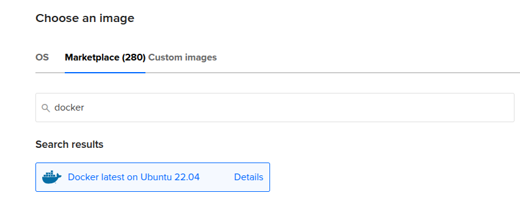
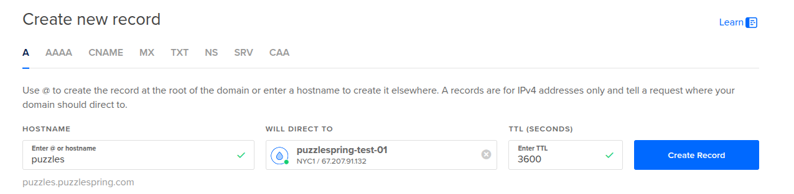
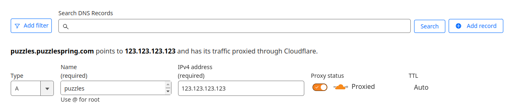

# Setting up PuzzleSpring on DigitalOcean

This guide walks you through deploying PuzzleSpring on DigitalOcean using their pre-configured Docker droplet. This approach provides a simple and reliable way to get your puzzlehunt platform up and running quickly.

## Prerequisites

- A DigitalOcean account
- A domain name (optional, but recommended for production)
- Basic familiarity with terminal commands

## Step 1: Create a Docker Droplet

1. Log in to your DigitalOcean account and navigate to the dashboard
2. Click on "Create" and select "Droplets"
3. In the Marketplace tab, search for and select "Docker"

   
   *Figure 1: Selecting the Docker image from DigitalOcean's Marketplace*

4. Choose a plan based on your expected traffic:
   - For small to medium hunts: Basic Shared CPU, Regular with 2GB RAM / 1 CPU
   - For larger hunts: Consider 4GB RAM / 2 CPU or higher

5. Choose a datacenter region closest to your expected users

6. Authentication:
   - Choose SSH keys (recommended) or Password
   - If using SSH keys, add your public key or create a new one

7. Add a hostname (e.g., `puzzlehunt-server`)

8. Click "Create Droplet" and wait for it to provision

## Step 2: Configure DNS (Optional but Recommended)

If you have a domain name, you'll need to point it to your droplet's IP address. There are two approaches depending on where your domain is managed:

### Option A: Domain Managed by DigitalOcean

If your domain's DNS is already managed by DigitalOcean:

1. In the DigitalOcean dashboard, go to "Networking" → "Domains"
2. Add your domain if it's not already there
3. Create an A record pointing to your droplet's IP address:
   - Name: @ (for root domain) or subdomain (e.g., "puzzles")
   - Directed to: Your droplet
   - TTL: 3600 (default)

   
   *Figure 2: Setting up an A record in DigitalOcean's DNS management interface*

### Option B: Domain Managed by Another Provider

If your domain is managed by another provider (like Namecheap, Cloudflare, Google Domains, etc.):

1. Log in to your domain registrar's website
2. Navigate to the DNS management section
3. Create an A record pointing to your droplet's IP address:
   - Host/Name: @ (for root domain) or subdomain (e.g., "puzzles")
   - Value/Points to: Your droplet's IP address
   - TTL: 3600 (or default)

   
   *Figure 3: Example of configuring an A record in Cloudflare's DNS management interface*

4. Wait for DNS propagation (can take up to 24 hours, but often much faster)

You can verify DNS propagation using the `dig` command or online tools like [dnschecker.org](https://dnschecker.org).

## Step 3: Connect to Your Droplet

Connect to your droplet using SSH:

```bash
ssh root@your-droplet-ip
```

If you used password authentication, you'll be prompted to enter your password.

## Step 4: Deploy PuzzleSpring

Once connected to your droplet, follow these steps to deploy PuzzleSpring:

1. Clone the PuzzleSpring repository:

```bash
git clone https://github.com/dlareau/puzzlespring.git
cd puzzlespring
```

2. Create and configure your environment file:

```bash
cp sample.env .env
nano .env
```

3. Update the following variables in your `.env` file:

```
# Required settings
DOMAIN=your-domain.com  # Use your actual domain or droplet IP
DB_PASSWORD=your-secure-password  # Create a strong password
DJANGO_SECRET_KEY=your-secure-key  # Generate a secure key (see below)

# Production settings
HTTP_PORT=80
HTTPS_PORT=443
```

To generate a secure Django secret key, you can use:

```bash
python3 -c 'from django.core.management.utils import get_random_secret_key; print(get_random_secret_key())'
```

4. Start the application:

```bash
docker compose up -d
```

This will download all necessary Docker images and start the services. The first run may take several minutes.

5. Run the initial setup:

```bash
docker compose exec app python manage.py initial_setup
```

Follow the interactive prompts to create your superuser account.

## Step 5: Access Your PuzzleSpring Instance

If you configured a domain:
- Access your site at `https://your-domain.com`

If you're using the droplet's IP address:
- Access your site at `https://your-droplet-ip`

Log in with the superuser credentials you created during the initial setup.

## Viewing Logs

To view logs for troubleshooting:

```bash
# View logs for all services
docker compose logs

# View logs for a specific service
docker compose logs app
docker compose logs caddy
```

## Scaling Your Droplet

If you need more resources during a hunt:

1. In the DigitalOcean dashboard, select your droplet
2. Click on "Resize"
3. Choose a larger plan
4. Click "Resize"

This operation requires a brief downtime while the droplet restarts.

## Troubleshooting

### Common Issues

1. **SSL Certificate Issues**
   - Ensure your domain is correctly pointed to your droplet's IP
   - Check that ports 80 and 443 are open in your firewall
   - Verify `DOMAIN` in your `.env` file doesn't include a port number

2. **Database Connection Issues**
   - Check your `DB_PASSWORD` in the `.env` file
   - Ensure the database container is running: `docker compose ps`

3. **Static Files Missing**
   - Run: `docker compose exec app python manage.py collectstatic --noinput`

### Getting Help

If you encounter issues not covered in this guide:

- Check the [PuzzleSpring documentation](https://www.puzzlespring.com/docs)
- Look for similar issues in the [GitHub repository](https://github.com/dlareau/puzzlespring/issues)

